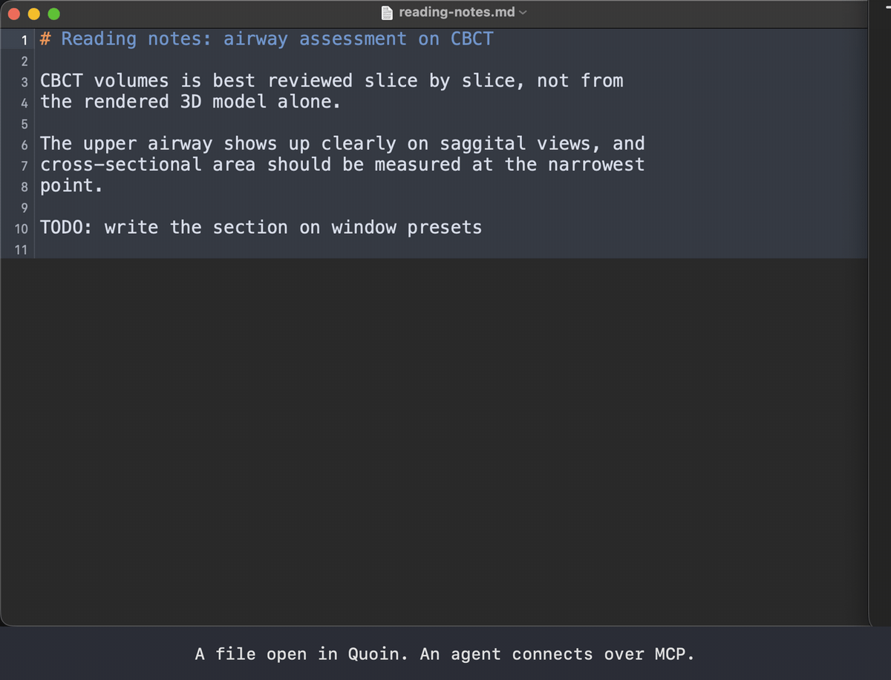
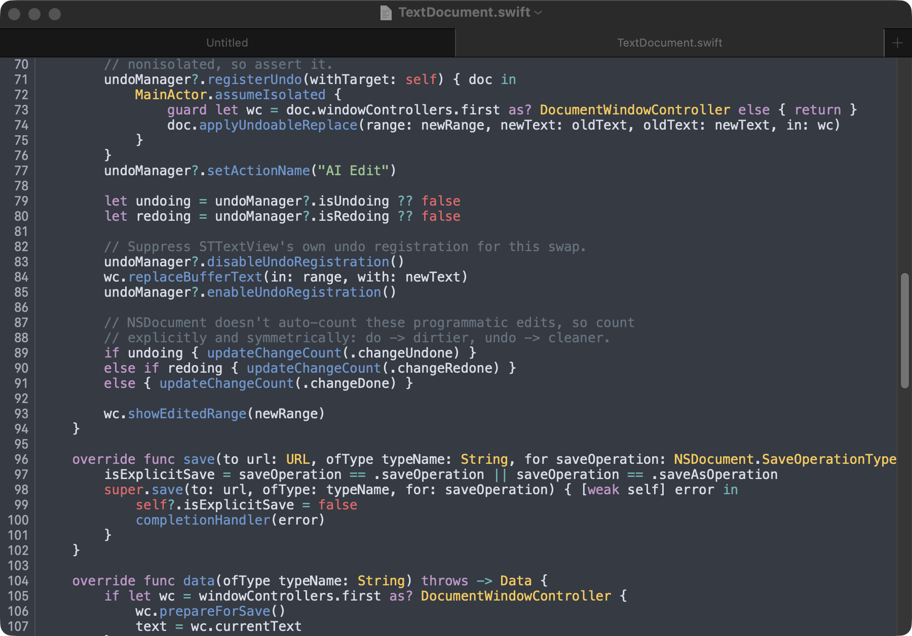
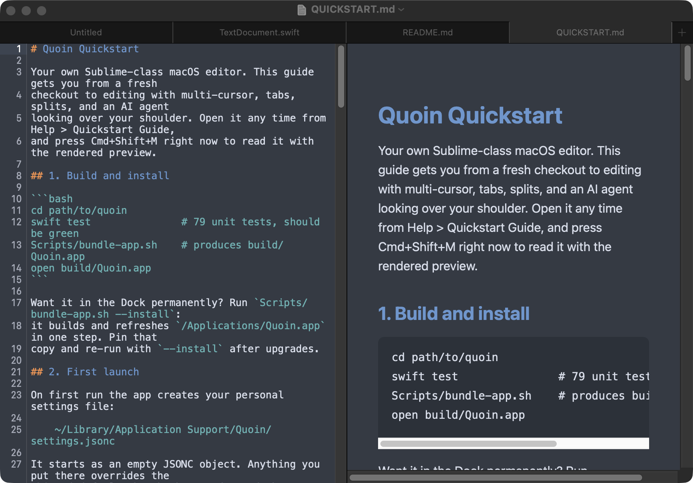

# Quoin


*the agent edits, you decide.*

[](https://github.com/rezamotaghi/quoin/actions/workflows/ci.yml)



*Above: a real session, captured live. An agent connected over MCP applies
three edits to the open buffer (a grammar fix, a typo, a missing section);
each lands selected and unsaved. Then plain undo, the same step Cmd+Z
triggers, peels the agent's edits off one at a time until the original text
is back and the buffer is clean. One agent edit, one undo step; disk is
never touched until you save.*

A quoin (pronounced "coin") is the letterpress wedge that locks loose type
into the frame so it can print. That is this editor's job in the agent era:
hold the text steady while agents work on it; nothing is committed until you
lock it in.

Quoin is a macOS text editor where AI agents are first-class users. An agent
connected over MCP reads and edits the live buffer, unsaved changes included.
Every agent edit lands as one undoable step on the normal undo stack, and
nothing touches disk until you press Cmd+S: the agent proposes, you dispose.

Beyond the agent surface, it is a Sublime-class editor: native tabs,
tree-sitter highlighting, Goto Anything, command palette, split panes,
multi-cursor, hot exit. Swift + AppKit, pure SwiftPM, macOS 14+, no
Xcode.app required.

## Why there's no AI inside

Quoin ships no model, no API keys, no chat pane. It is the instrument: you
bring whatever agent you want, over MCP, and swap it the day a better one
exists. Editors that embed a single vendor's agent make the editor the
gatekeeper; here the editor's whole job is to give any agent honest access
to the buffer and give you the only save button. It is one of a pair of
agent-native instruments built on the same principle (bounded verbs for the
agent, commit rights for the human); the other is
[CBCTScope](https://github.com/rezamotaghi/cbctscope), a CBCT viewer for
medical imaging. Both at [rezamotaghi.com](https://rezamotaghi.com).

## Quickstart

```bash
swift test               # 79 unit tests
Scripts/bundle-app.sh    # -> build/Quoin.app
open build/Quoin.app
```

Full guide: [QUICKSTART.md](QUICKSTART.md), also in-app via Help > Quickstart
Guide. Architecture and invariants: [ARCHITECTURE.md](ARCHITECTURE.md).

## Connect an AI agent (MCP)

The running app listens on a local unix socket (no network listener, local-only
by construction). The bundled shim exposes that socket as an MCP server:

```bash
claude mcp add quoin -- "$(pwd)/build/Quoin.app/Contents/MacOS/QuoinMCP"
```

Read tools: `quoin_list_open_documents`, `quoin_read_buffer` (live
buffer, including unsaved edits), `quoin_get_selection`,
`quoin_open_file` (path + line), `quoin_list_commands`,
`quoin_run_command`. Write tools: `quoin_replace_selection`,
`quoin_apply_edit` (offset range), `quoin_set_text`.

Each write is registered as its own inverse on the document's undo manager, so
Cmd+Z peels agent edits off one at a time, back to a pristine buffer. Edits
mark the document dirty like typing does; the file on disk changes only when
you save. Turn the whole surface off with `"agent_server": false` in settings.

## Open files from a terminal

```bash
ln -s "$(pwd)/Scripts/quoin" /usr/local/bin/quoin   # once, from the repo root
quoin notes.md                                       # open a file
quoin src/main.swift:42                              # open at line 42
```

`quoin` drives the `quoin://open?file=...&line=...` URL scheme; anything
else on the machine can use those links directly.

## Editing features

<p align="center">
  
  
</p>

*Left: tree-sitter highlighting (Mariana scheme) on the code that makes
agent edits undoable. Right: markdown coloring beside the rendered preview,
Cmd+Shift+M. Both are the real app, captured over its own MCP surface.*

| Key | Action |
|---|---|
| Cmd+P | Goto Anything (fuzzy file open in the project folder) |
| Cmd+Shift+P | Command Palette |
| Cmd+D | Select word, then add next occurrence (multi-cursor) |
| Ctrl+Cmd+G | Select all occurrences |
| Escape | Collapse to one caret |
| Cmd+Alt+2 | Toggle split editor (two views, one buffer) |
| Cmd+F | Find; Cmd+Alt+F find and replace |
| Cmd+Shift+M | Markdown preview |
| Cmd+Shift+[ / ] | Previous / next tab |

Tree-sitter highlighting ships for Swift, Python, JSON, and Markdown; JSONC
uses a hand-rolled lexer, and other file types open unhighlighted as plain
text. Hot exit is on by default: quit and
relaunch restores every tab, including unsaved buffers (graceful quit; a
force-kill loses them). If anything rewrites a file you have unsaved edits in,
a banner offers Reload From Disk / Keep My Edits.

## Settings

Sublime key names, JSONC, hot-reloaded on save:

- Defaults (documented): `Settings/default-settings.jsonc` (ships in the app)
- Your overrides: `~/Library/Application Support/Quoin/settings.jsonc`
- Color schemes: `Settings/schemes/*.jsonc` (`mariana` dark, `breakers`
  light, `"theme": "auto"` follows macOS)

## Contributing

Small, tested, one-concern PRs are welcome: [CONTRIBUTING.md](CONTRIBUTING.md)
has the build steps and conventions. Security reports go through private
advisories, not issues: [SECURITY.md](SECURITY.md). Release history:
[CHANGELOG.md](CHANGELOG.md).

## License

MIT, see [LICENSE](LICENSE).

Built by Dr. Reza Motaghi. More at [rezamotaghi.com](https://rezamotaghi.com).
