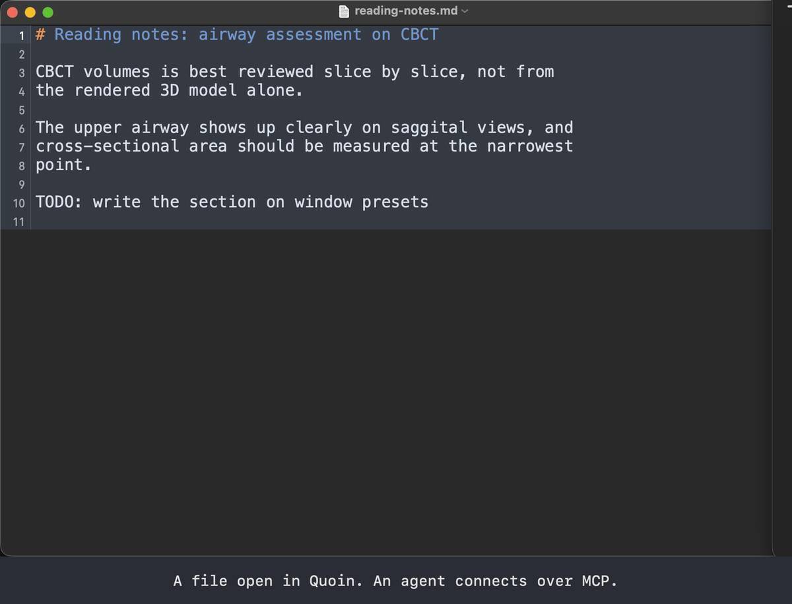
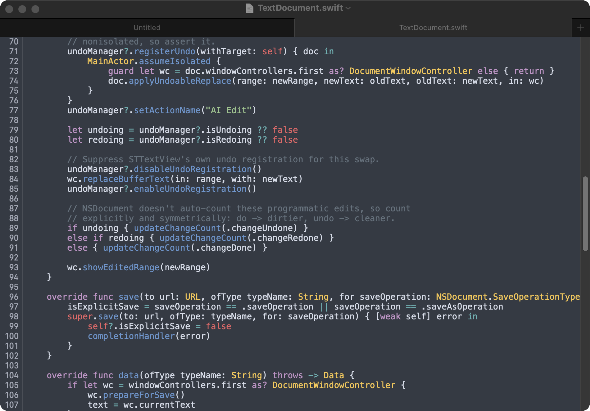
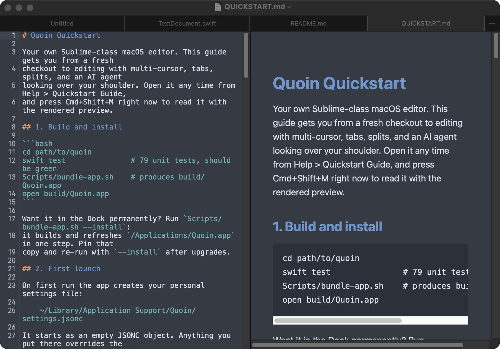

# Quoin


*the agent edits, you decide.*

[](https://github.com/rezamotaghi/quoin/actions/workflows/ci.yml)



*Above: a real session, captured live. An agent connected over MCP applies
three edits to the open buffer (a grammar fix, a typo, a missing section);
each lands selected and unsaved. Then plain undo, the same step Cmd+Z
triggers, peels the agent's edits off one at a time until the original text
is back and the buffer is clean. One agent edit, one undo step; disk is
never touched until you save.*

A quoin (pronounced "coin") is the letterpress wedge that locks loose type
into the frame so it can print. That is this editor's job in the agent era:
hold the text steady while agents work on it; nothing is committed until you
lock it in.

Quoin is a macOS text editor where AI agents are first-class users. An agent
connected over MCP reads and edits the live buffer, unsaved changes included.
Every agent edit lands as one undoable step on the normal undo stack, and
nothing touches disk until you press Cmd+S: the agent proposes, you dispose.

Beyond the agent surface, it is a Sublime-class editor: native tabs,
tree-sitter highlighting, Goto Anything, command palette, split panes,
multi-cursor, hot exit, and Sublime's menu vocabulary (line, comment, case,
sort and permute commands, selection tools, syntax and indentation
switches), every item of which is also an agent verb. Swift + AppKit, pure
SwiftPM, macOS 14+, no Xcode.app required.

## Why there's no AI inside

Quoin ships no model, no API keys, no chat pane. It is the instrument: you
bring whatever agent you want, over MCP, and swap it the day a better one
exists. Editors that embed a single vendor's agent make the editor the
gatekeeper; here the editor's whole job is to give any agent honest access
to the buffer and give you the only save button. It is one of a pair of
agent-native instruments built on the same principle (bounded verbs for the
agent, commit rights for the human); the other is
[CBCTScope](https://github.com/rezamotaghi/cbctscope), a CBCT viewer for
medical imaging. Both at [rezamotaghi.com](https://rezamotaghi.com).

## Quickstart

```bash
swift test               # 109 unit tests
Scripts/bundle-app.sh    # -> build/Quoin.app
open build/Quoin.app
```

Full guide: [QUICKSTART.md](QUICKSTART.md), also in-app via Help > Quickstart
Guide. Architecture and invariants: [ARCHITECTURE.md](ARCHITECTURE.md).

## Connect an AI agent (MCP)

The running app listens on a local unix socket (no network listener, local-only
by construction). The bundled shim exposes that socket as an MCP server:

```bash
claude mcp add quoin -- "$(pwd)/build/Quoin.app/Contents/MacOS/QuoinMCP"
```

The same line is under Agent > Copy MCP Setup Command in the app. For Claude
Desktop, each release carries `quoin-<version>.mcpb`, a one-click MCP Bundle
of the shim (Apple silicon).

Eleven verbs, each self-describing (annotations and an output schema):

- Read: `quoin_list_open_documents`, `quoin_read_buffer` (the live buffer,
  unsaved edits included), `quoin_read_lines` (a window of lines),
  `quoin_get_selection`, `quoin_list_commands`.
- Act: `quoin_open_file` (path and line), `quoin_run_command` (any menu
  command by id).
- Write: `quoin_replace_selection`, `quoin_replace_lines`, `quoin_apply_edit`
  (offset range), `quoin_set_text` (whole buffer).

Each write is one step on the normal undo stack, so Cmd+Z peels agent edits
off one at a time, back to a pristine buffer, whether or not you were at the
keyboard. Edits mark the document dirty like typing does; the file on disk
changes only when you save. The commit fence makes that a mechanism rather
than a sentence: `save`, `save as`, `revert`, `close`, and `quit` are
refused over the agent surface, so the only save button is yours.

Beyond verbs: the open buffers are MCP resources (`quoin://buffer` and
`quoin://selection` for the front document, `quoin://buffer/<absolute path>`
and `quoin://selection/<absolute path>` for any open file,
`quoin://documents`), and a host can subscribe to a buffer and be told the
moment it changes instead of polling. Three prompts package the choreographies
(`proofread-selection`, `review-buffer`, `undo-tour`), and
[skills/quoin-editing/SKILL.md](skills/quoin-editing/SKILL.md) teaches any
host the verbs and the contract. Turn the whole surface off with
`"agent_server": false` in settings, or in the Agent menu.

## Open files from a terminal

```bash
ln -s "$(pwd)/Scripts/quoin" /usr/local/bin/quoin   # once, from the repo root
quoin notes.md                                       # open a file
quoin src/main.swift:42                              # open at line 42
```

`quoin` drives the `quoin://open?file=...&line=...` URL scheme; anything
else on the machine can use those links directly.

## Editing features

<p align="center">
  
  
</p>

*Left: tree-sitter highlighting (Mariana scheme) on the code that makes
agent edits undoable. Right: markdown coloring beside the rendered preview,
Cmd+Shift+M. Both are the real app, captured over its own MCP surface.*

| Key | Action |
|---|---|
| Cmd+P | Goto Anything (fuzzy file open in the project folder) |
| Cmd+Shift+P | Command Palette |
| Cmd+D | Select word, then add next occurrence (multi-cursor) |
| Ctrl+Cmd+G | Select all occurrences |
| Escape | Collapse to one caret |
| Cmd+Alt+2 | Toggle split editor (two views, one buffer) |
| Cmd+F | Find; Cmd+Alt+F find and replace |
| Cmd+Shift+D / Ctrl+Shift+K | Duplicate / delete line; Ctrl+Cmd+Up/Down swap lines |
| Cmd+/ | Toggle comment (per-language token) |
| Cmd+Shift+L | Split selection into lines; Ctrl+Shift+Up/Down add a caret on the previous / next line |
| Ctrl+G | Goto line |
| Cmd+Shift+M | Markdown preview |
| Cmd+Shift+[ / ] | Previous / next tab |
| Cmd+, | Settings (your settings.jsonc, in the editor) |

Ten menus carry Sublime's vocabulary: Edit > Line, Comment, Convert Case,
Sort Lines, Permute Lines; Selection; Find; View > Word Wrap, Line Numbers,
Whitespace, Syntax, Indentation, Font, Theme; Goto; and an Agent menu (status,
the setup command, the server switch, Undo Last Agent Edit). Every item is
also a palette command and an agent verb; the View toggles write your
settings file in place, comments kept. Tree-sitter highlighting ships for
Swift, Python, JSON, and Markdown; JSONC uses a hand-rolled lexer, and other
file types open unhighlighted as plain text (View > Syntax overrides per
document). Hot exit is on by default: quit and
relaunch restores every tab, including unsaved buffers (graceful quit; a
force-kill loses them). If anything rewrites a file you have unsaved edits in,
a banner offers Reload From Disk / Keep My Edits.

## Settings

Sublime key names, JSONC, hot-reloaded on save:

- Defaults (documented): `Settings/default-settings.jsonc` (ships in the app)
- Your overrides: `~/Library/Application Support/Quoin/settings.jsonc`
- Color schemes: `Settings/schemes/*.jsonc` (`mariana` dark, `breakers`
  light, `"theme": "auto"` follows macOS)

## Contributing

Small, tested, one-concern PRs are welcome: [CONTRIBUTING.md](CONTRIBUTING.md)
has the build steps and conventions. Security reports go through private
advisories, not issues: [SECURITY.md](SECURITY.md). Release history:
[CHANGELOG.md](CHANGELOG.md).

## License

MIT, see [LICENSE](LICENSE).

Built by Dr. Reza Motaghi, an oral and maxillofacial radiologist who trains imaging
models on his own reads and tests them on cases they have never seen. More at [rezamotaghi.com](https://rezamotaghi.com).

Sublime Text is a trademark of Sublime HQ Pty Ltd. Quoin is an independent
project, not affiliated with or endorsed by Sublime HQ.
